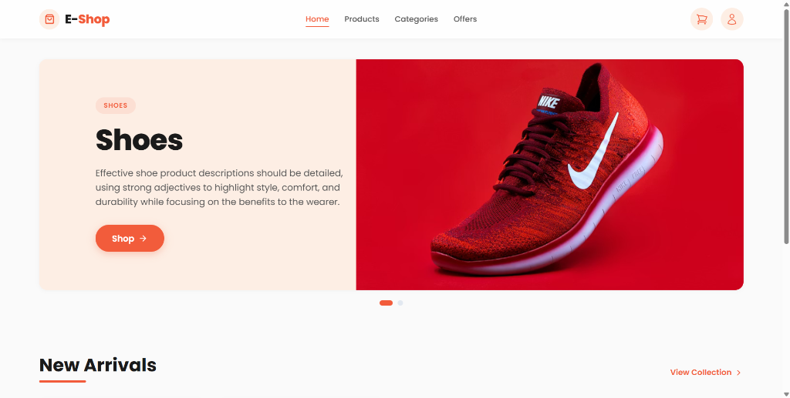
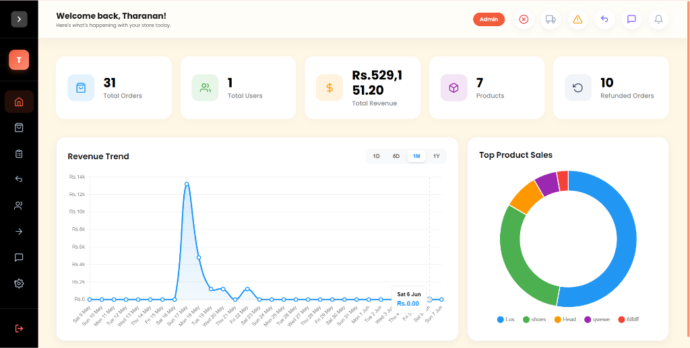
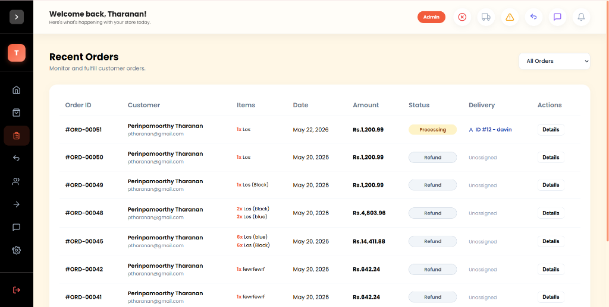
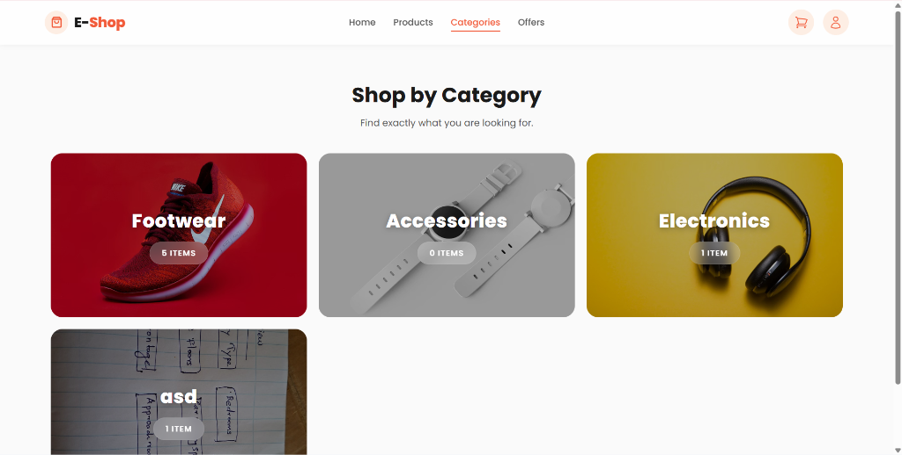

<p align="center">
  
  
  
  
  
  
  
</p>

# 🛒 E-Shop — Multi-Vendor E-Commerce Platform

A full-featured, production-ready **multi-vendor e-commerce platform** built with **Laravel 12**. E-Shop supports multiple user roles — **Admin**, **Seller**, **Delivery Partner**, and **Customer** — each with dedicated dashboards, real-time notifications, and comprehensive management tools. Integrated with **Stripe** and **PayPal** for secure global payments.

<p align="center">
  <a href="http://e-com.fwh.is/" target="_blank">
    
  </a>
</p>

> **🔗 Live Demo:** [E-Shop](http://e-com.fwh.is/)

---

## 📸 Screenshots

<p align="center">
  
  <br/><em>🏠 Storefront — Hero banner carousel with new arrivals and product listings</em>
</p>

<p align="center">
  
  <br/><em>📊 Admin Dashboard — Revenue trends, KPI cards, and top product sales analytics</em>
</p>

<p align="center">
  
  <br/><em>📦 Order Management — Track orders, assign delivery, process refunds</em>
</p>

<p align="center">
  
  <br/><em>🗂️ Category Browser — Visual category grid with item counts</em>
</p>

---

## ✨ Key Features

### 🛍️ Storefront (Customer-Facing)
- **Product Catalog** with search, filtering, and category browsing
- **Product Detail Pages** with image galleries, color/size variants, and stock indicators
- **Shopping Cart** with real-time stock validation
- **Secure Checkout** via Stripe and PayPal with multi-currency support
- **Product Reviews & Ratings** with star ratings and seller replies
- **Special Offers Page** displaying active discounts and deals
- **Dynamic Banner Carousel** on the homepage
- **Order Tracking** with real-time status updates via SSE

### 🏪 Admin Dashboard
- **Analytics Dashboard** with revenue trends (1D/6D/1M/1Y), KPI cards, and top product sales charts
- **Product Management** — CRUD operations with image uploads, variants, discount pricing, and stock tracking
- **Order Management** — View, filter, update status, assign delivery partners, and process refunds
- **Return Request Handling** — Approve/reject returns and assign pickup delivery
- **Category Management** with image support
- **Banner Management** — Create/reorder homepage banners
- **Customer Management** — View customer details and order history
- **Delivery Partner Management** — Approve applications, set fees, assign/release partners
- **Seller Management** — Manage seller accounts, block/unblock sellers
- **Multi-Admin Accounts** — Create and manage admin sub-accounts
- **Currency Configuration** with live exchange rate conversion
- **Auto-Delete Settings** — Configurable automatic cleanup of old records via stored procedures
- **Real-Time Notifications** via SSE (Server-Sent Events)

### 👨‍💼 Seller Dashboard
- **Dedicated Seller Portal** with personalized analytics
- **Product Management** — Sellers manage their own product listings
- **Order & Return Management** scoped to seller's products
- **Delivery Partner Oversight** — Manage delivery partners assigned to the seller's store
- **Customer Insights** — View customers who purchased from the seller
- **Auto-Delete Configuration** — Seller-level cleanup settings

### 🚚 Delivery Partner Portal
- **Application System** — Apply to work with specific stores
- **Work Dashboard** — View and accept delivery assignments
- **Order Pickup & Delivery** — Scan-based verification with image proof
- **Return Pickups** — Handle product return logistics
- **Delivery History** — Complete log of past deliveries
- **Balance Tracking** — Earnings and fee management

### 🔐 Authentication & Security
- **Email-Based OTP Verification** for all user registrations
- **Forgot Password Flow** with OTP-based reset
- **Role-Based Access Control** — Admin, Seller, Delivery Boy, Customer
- **Middleware Protection** for each role's routes
- **Account Blocking** — Admins can block sellers and users
- **Soft Deletes** — Safe account deletion with audit trail

### 💳 Payment Processing
- **Stripe Integration** — Secure card payments with Payment Intents API
- **PayPal Integration** — PayPal checkout flow with sandbox/live modes
- **Refund Processing** — Full refund support through both gateways
- **Multi-Currency Support** — Configurable currency with exchange rate API

### 📧 Email Notifications
- **Order Confirmation** emails to customers
- **Order Status Updates** (processing, shipped, delivered, cancelled)
- **Return Status Notifications**
- **Work Assignment Notifications** for delivery partners
- **OTP Verification Emails** for registration and password reset

---

## 🛠️ Tech Stack

| Layer            | Technology                                                    |
|------------------|---------------------------------------------------------------|
| **Backend**      | Laravel 12, PHP 8.2+                                         |
| **Frontend**     | Blade Templates, HTML5, CSS3, JavaScript                      |
| **CSS Framework**| Tailwind CSS 4.0                                              |
| **Database**     | MySQL 8.0                                                     |
| **Build Tool**   | Vite 7.x with Laravel Vite Plugin                             |
| **Payments**     | Stripe (`stripe/stripe-php`), PayPal (`srmklive/paypal`)      |
| **Real-Time**    | Server-Sent Events (SSE)                                      |
| **Email**        | Laravel Mail (SMTP — Gmail)                                   |
| **Queue**        | Laravel Queue (Database driver)                               |
| **Deployment**   | AWS Lambda ready via Bref (`bref/bref`, `bref/laravel-bridge`)|

---

## 📁 Folder Structure

```
e-com/
├── app/
│   ├── Console/               # Artisan console commands
│   ├── Helpers/
│   │   └── currency.php       # Global currency formatting helpers
│   ├── Http/
│   │   ├── Controllers/
│   │   │   ├── AdminDashboardController.php    # Admin analytics & KPIs
│   │   │   ├── AdminDeliveryController.php     # Delivery partner management
│   │   │   ├── AdminSellerController.php       # Seller & admin account management
│   │   │   ├── AuthController.php              # Authentication (all roles)
│   │   │   ├── BannerController.php            # Homepage banner CRUD
│   │   │   ├── CategoryController.php          # Category management
│   │   │   ├── CurrencyController.php          # Currency & exchange rate settings
│   │   │   ├── CustomerController.php          # Customer data management
│   │   │   ├── DashboardController.php         # Customer dashboard & order history
│   │   │   ├── DeliveryController.php          # Delivery partner operations
│   │   │   ├── NotificationController.php      # Real-time notification polling
│   │   │   ├── OrderController.php             # Order lifecycle management
│   │   │   ├── PayPalController.php            # PayPal payment integration
│   │   │   ├── ProductController.php           # Product CRUD & stock management
│   │   │   ├── ReturnRequestController.php     # Return/refund request handling
│   │   │   ├── ReviewController.php            # Product reviews & replies
│   │   │   ├── SSEController.php               # Server-Sent Events streaming
│   │   │   ├── SellerDashboardController.php   # Seller-specific analytics
│   │   │   ├── SiteSettingController.php       # Auto-delete & site config
│   │   │   └── StripeController.php            # Stripe payment integration
│   │   └── Middleware/
│   │       ├── AdminMiddleware.php             # Admin role guard
│   │       ├── DeliveryMiddleware.php          # Delivery partner role guard
│   │       └── SellerMiddleware.php            # Seller role guard
│   ├── Mail/
│   │   ├── OrderStatusMail.php                # Order status change emails
│   │   ├── OrderSuccessMail.php               # Order confirmation emails
│   │   ├── OtpMail.php                        # OTP verification emails
│   │   ├── ReturnStatusMail.php               # Return status update emails
│   │   └── WorkAssignedMail.php               # Delivery assignment emails
│   ├── Models/
│   │   ├── Banner.php                         # Homepage banner model
│   │   ├── Category.php                       # Product category model
│   │   ├── DeliveryApplication.php            # Delivery partner application
│   │   ├── Order.php                          # Order with payment processing
│   │   ├── OrderDelivery.php                  # Delivery tracking & proof
│   │   ├── OrderReturn.php                    # Return request model
│   │   ├── Product.php                        # Product with variants & reviews
│   │   ├── ProductReview.php                  # Customer review model
│   │   ├── ProductVariant.php                 # Color/size variant model
│   │   ├── SellerAssignment.php               # Seller-to-store assignment
│   │   ├── SiteSetting.php                    # Key-value site configuration
│   │   ├── User.php                           # Multi-role user model (SoftDeletes)
│   │   └── UserInfo.php                       # Extended user profile data
│   ├── Notifications/                         # Push notification classes
│   ├── Providers/                             # Service providers
│   └── Traits/                                # Reusable model traits
├── config/
│   ├── paypal.php                             # PayPal SDK configuration
│   ├── services.php                           # Third-party service keys
│   └── ...                                    # Standard Laravel config files
├── database/
│   ├── migrations/                            # 52 migration files (schema evolution)
│   ├── seeders/                               # Database seeders
│   └── database.sqlite                        # SQLite fallback for development
├── public/
│   ├── images/                                # Static image assets
│   ├── lottie/                                # Lottie animation files
│   ├── media/                                 # Uploaded media storage
│   └── sounds/                                # Notification sound files
├── resources/
│   ├── css/                                   # Source stylesheets
│   ├── js/                                    # Source JavaScript
│   └── views/
│       ├── admin/                             # Admin panel views (18 templates)
│       ├── auth/                              # Password reset flow views
│       ├── delivery/                          # Delivery partner views (6 templates)
│       ├── emails/                            # Email templates (5 templates)
│       ├── errors/                            # Error page views
│       ├── layouts/
│       │   ├── admin.blade.php                # Admin layout with sidebar
│       │   ├── delivery.blade.php             # Delivery partner layout
│       │   ├── master.blade.php               # Public storefront layout
│       │   └── seller.blade.php               # Seller dashboard layout
│       ├── seller/                            # Seller panel views (11 templates)
│       ├── cart.blade.php                     # Shopping cart page
│       ├── categories.blade.php               # Category listing page
│       ├── checkout-success.blade.php         # Payment success page
│       ├── dashboard.blade.php                # Customer dashboard
│       ├── index.blade.php                    # Homepage
│       ├── login.blade.php                    # Customer login
│       ├── offers.blade.php                   # Special offers page
│       ├── product-detail.blade.php           # Product detail page
│       ├── products.blade.php                 # Product listing page
│       └── register.blade.php                # Customer registration
├── routes/
│   └── web.php                                # All application routes (309 lines)
├── screenshots/                               # README screenshot assets
├── ecommerce_db.sql                           # Database dump for quick setup
├── composer.json                              # PHP dependencies
├── package.json                               # Node.js dependencies
├── vite.config.js                             # Vite build configuration
├── serverless.yml                             # AWS Lambda deployment config
└── startup.sh                                 # Server startup script
```

---

## 🚀 Getting Started

### Prerequisites

| Requirement    | Version   |
|----------------|-----------|
| PHP            | ≥ 8.2     |
| Composer       | ≥ 2.x     |
| Node.js        | ≥ 18.x    |
| MySQL          | ≥ 8.0     |
| npm            | ≥ 9.x     |

### Installation

1. **Clone the repository**

   ```bash
   git clone https://github.com/PTharanan/e-com.git
   cd e-com
   ```

2. **Install PHP dependencies**

   ```bash
   composer install
   ```

3. **Install Node.js dependencies**

   ```bash
   npm install
   ```

4. **Environment configuration**

   ```bash
   cp .env.example .env
   php artisan key:generate
   ```

5. **Configure your `.env` file**

   Update the following values in `.env`:

   ```env
   # Database
   DB_CONNECTION=mysql
   DB_HOST=127.0.0.1
   DB_PORT=3306
   DB_DATABASE=ecommerce_db
   DB_USERNAME=root
   DB_PASSWORD=your_password

   # Stripe Payment Gateway
   STRIPE_KEY=your_stripe_publishable_key
   STRIPE_SECRET=your_stripe_secret_key

   # PayPal Payment Gateway
   PAYPAL_SANDBOX_CLIENT_ID=your_paypal_client_id
   PAYPAL_SANDBOX_CLIENT_SECRET=your_paypal_client_secret
   PAYPAL_MODE=sandbox

   # Mail (SMTP)
   MAIL_MAILER=smtp
   MAIL_HOST=smtp.gmail.com
   MAIL_PORT=465
   MAIL_USERNAME=your_email@gmail.com
   MAIL_PASSWORD=your_app_password
   MAIL_ENCRYPTION=ssl

   # Exchange Rate API (for multi-currency)
   EXCHANGE_RATE_API_KEY=your_api_key
   ```

6. **Database setup**

   **Option A — Run migrations:**
   ```bash
   php artisan migrate
   ```

   **Option B — Import the SQL dump (includes sample data):**
   ```bash
   mysql -u root -p ecommerce_db < ecommerce_db.sql
   ```

7. **Build frontend assets**

   ```bash
   npm run build
   ```

8. **Start the development server**

   ```bash
   # Quick start — runs server, queue, logs, and Vite concurrently
   composer dev
   ```

   Or start services individually:
   ```bash
   php artisan serve
   php artisan queue:listen
   npm run dev
   ```

9. **Access the application**

   | Portal          | URL                                  |
   |-----------------|--------------------------------------|
   | Storefront      | `http://localhost:8000`               |
   | Admin Panel     | `http://localhost:8000/admin/sign-in` |
   | Seller Portal   | `http://localhost:8000/seller/sign-in`|
   | Delivery Portal | `http://localhost:8000/delivery/sign-in` |

---

## 👥 User Roles & Access

| Role              | Description                                                                 |
|-------------------|-----------------------------------------------------------------------------|
| **Customer**      | Browse products, manage cart, checkout, track orders, submit reviews         |
| **Admin**         | Full platform control — products, orders, sellers, delivery, analytics       |
| **Seller**        | Manage own products, view orders, handle returns, track revenue              |
| **Delivery Boy**  | Accept deliveries, verify pickups, manage returns, track earnings            |

---

## 💳 Payment Integration

### Stripe
- Supports card payments via the **Payment Intents API**
- Automatic refund processing
- Test mode supported with sandbox keys

### PayPal
- Full PayPal checkout flow integration
- Sandbox and live mode switching via `PAYPAL_MODE`
- Order capture and refund support

---

## 📡 Real-Time Features

- **Server-Sent Events (SSE)** for live notification streaming
- **Notification Sound Alerts** for new orders and assignments
- **Lottie Animations** for enhanced UI feedback (success states, loading indicators)

---

## ☁️ Deployment

### Traditional Server (XAMPP / VPS)

```bash
composer install --optimize-autoloader --no-dev
npm run build
php artisan config:cache
php artisan route:cache
php artisan view:cache
```

### AWS Lambda (Serverless)

The project includes `serverless.yml` and `bref` packages for serverless deployment:

```bash
serverless deploy
```

---

## 🤝 Contributing

1. Fork the repository
2. Create your feature branch (`git checkout -b feature/amazing-feature`)
3. Commit your changes (`git commit -m 'Add amazing feature'`)
4. Push to the branch (`git push origin feature/amazing-feature`)
5. Open a Pull Request

---

## 📄 License

This project is licensed under the **MIT License** — see the [LICENSE](LICENSE) file for details.

---

## 📬 Contact

**Perinpamoorthy Tharanan**

- GitHub: [@PTharanan](https://github.com/PTharanan)
- Email: ptharanan@gmail.com

---

<p align="center">
  <strong>⭐ Star this repo if you found it helpful!</strong>
</p>
